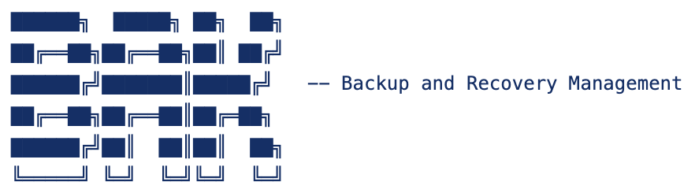

Bak is a data recovery tool specifically designed for Docker containers. With Bak you can:
* Take snapshots of application states
* Revert back to previous states
* Automate when snapshots take place
* Clean up old snapshots or manually create new ones

# Usage

The Bak CLI currently runs on Linux and is written in BASH. It contains 4 key commands to manage snapshots:

```
Usage: bak COMMAND

Automated backup and rollback management for containers

Commands:
  register        Register an instance with a policy.
  update          Update an instance's policy.
  version         Get an instance's version history.
  rollback        Rollback an instance to a previous version.

Global Flags:
  -h, --help      Show this help message.
  -v, --version   Show version.
```

## Example

Revert back to version number 2. This will use the 2nd snapshot as the current volume accessed by the container. All the work is done for you behind the scenes.

```
bak rollback --container-name my-container --version-number 2
```